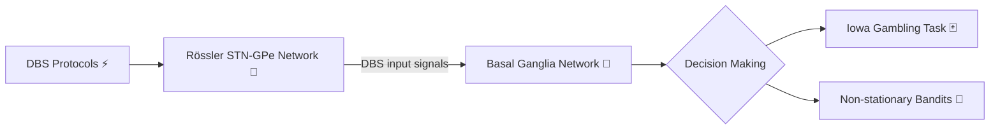

# 🧠⚡ Basal Ganglia DBS Model

> **Simulating the Parkinsonian brain — and what happens when we zap it.**
> A computational playground connecting STN–GPe oscillatory dynamics (Rössler oscillator networks) to decision-making behavior under Deep Brain Stimulation.

---

## 🎯 What's This About?

This repo explores two intertwined questions:

1. 🔀 **How does the basal ganglia drive decisions?** — A PyTorch-based BG network tested on classic decision-making tasks (Iowa Gambling Task 🃏, non-stationary bandits 🎰).
2. 🌊 **What do pathological brain rhythms look like — and can DBS fix them?** — An STN–GPe network modeled as coupled Rössler oscillators, simulated in *normal*, *Parkinson's disease*, and *DBS* conditions.

The bridge between them: precomputed STN–GPe activity from the oscillator model is fed as DBS input into the decision-making network — so you can watch how stimulation protocols reshape behavior. 



---

## 🗺️ Repository Map

```text
BasalGanglia_DBS_model/
├── 🧠 basal_ganglia/          # Decision-making network (PyTorch)
│   ├── BGNetwork.py           #   BG network + GPi race model
│   ├── train.py               #   Training & simulation loops
│   └── rossler_dbs_stn_data/  #   Precomputed STN-GPe activity (DBS inputs)
│       ├── closed_loop/ 🔁
│       ├── open_loop_high_amp/ 📢
│       ├── open_loop_low_amp/ 🔉
│       └── standard_dbs/ 💊
├── 🎮 envs/                   # Task environments
│   ├── igt.py                 #   Iowa Gambling Task
│   └── nonstationarybandits.py#   Non-stationary bandits
├── 🌊 stn_gpe/                # Oscillator model & DBS routines
│   ├── rossler_network.py     #   Rössler oscillator network
│   ├── rossler_dbs.py         #   Open/closed-loop & standard DBS sims
│   ├── analysis.py            #   Entropy, correlation, phase synchrony
│   └── utils.py               #   YAML I/O, weight generation
├── ⚙️ params/                 # YAML parameter files
│   ├── stn_gpe_params/
│   └── non_stationary_bandits_params/
├── 🧪 simulations/            # Experiment notebooks
│   ├── iowa_gambling_task/ 🃏
│   ├── non_stationary_bandits/ 🎰
│   ├── stn_gpe_simulations/   #   Bifurcations, single runs
│   └── stn_gpe_DBS_simulations/ ⚡
└── 📊 simulated_data/         # Saved data + plots
    ├── Bandits_data_plotting/
    ├── IGT_data_plotting/
    ├── Rossler_system_data_plotting/
    ├── Rossler_DBS_data_plotting/
    └── BG_architecture_main.png 🖼️
```

---

## 🔬 The Models

### 🧠 Basal Ganglia Decision-Making Network
- PyTorch implementation of the BG architecture with a **GPi race model** for action selection.
- Trained and evaluated on two tasks:
  - 🃏 **Iowa Gambling Task** — risky vs. safe deck selection
  - 🎰 **Non-stationary bandits** — explore/exploit trade-offs in a shifting world

### 🌊 STN–GPe Rössler Network
- Subthalamic nucleus ↔ globus pallidus externa modeled as **coupled Rössler oscillators**.
- Explore bifurcation regimes by sweeping coupling strength `k` and external current `I_ext`.

### ⚡ Three DBS Protocols Compared
| Protocol | Idea | Folder |
|---|---|---|
| 📢 Open-loop (high amp) | Fixed periodic pulses, high amplitude | `open_loop_high_amp/` |
| 🔉 Open-loop (low amp) | Fixed periodic pulses, low amplitude | `open_loop_low_amp/` |
| 🔁 Closed-loop | Stimulation driven by recorded neural state | `closed_loop/` |
| 💊 Standard clinical DBS | Conventional constant-frequency stimulation | `standard_dbs/` |

Analysis tools (`analysis.py`) quantify the effects via **entropy**, **correlation**, and **phase synchrony** measures.

---

## 🚀 Getting Started

### Install

```sh
pip install numpy torch matplotlib seaborn tqdm pyyaml pandas scipy notebook
```

### Run an Experiment

Most experiments live in notebooks under `simulations/`. Typical workflow:

1. 📓 Open a notebook in Jupyter or VS Code
2. ⚙️ Tweak parameters in `params/*.yaml`
3. ▶️ Run the cells
4. 📊 Inspect results in `simulated_data/`

### Use Programmatically

Run Python from the repository root:

```python
from envs import IGTEnv, NonStationaryEnv
from basal_ganglia import BGNetwork, train
from stn_gpe import RosslerNetwork
```

---

## 💡 Notes & Tips

- 🕐 Long simulations (many trials × epochs × oscillators) can take a while — grab a coffee ☕
- 💾 Some folders contain saved outputs from previous runs; regenerate anytime from the notebooks
- 🔇 Noise-condition notebooks are intentionally git-ignored to keep the repo lean

---

## 📬 Contact

Questions or ideas? Reach out to the repository maintainer. ✉️
